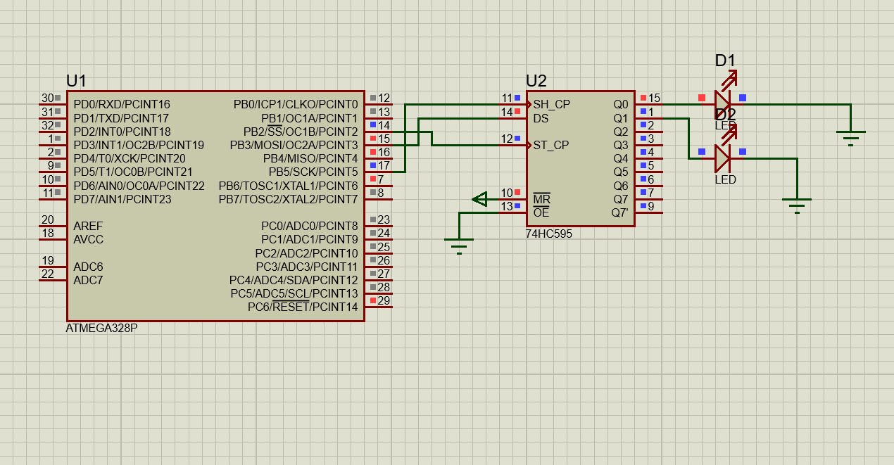

## AVR SPI LED Controller Overview

This project demonstrates SPI (Serial Peripheral Interface) communication using an AVR microcontroller configured in Master mode with direct register-level programming. The system periodically toggles two virtual LED control flags at different time intervals, combines their states into a 2-bit data frame, and transmits the data to an SPI slave device using the polling method to monitor transfer completion.

The project is designed as a practical example for understanding low-level SPI configuration, data transmission, and basic embedded timing control on ATmega microcontrollers.

## Features

SPI configured in Master mode

Register-level programming (SPCR, SPSR, SPDR)

Polling-based SPI data transmission

Software-controlled Slave Select (SS)

Two independent LED toggle signals

Simple timing control using delays

## How It Works

The AVR microcontroller initializes SPI as Master.

Two flags (flag_led1 and flag_led2) toggle at different intervals:

LED1 toggles every 500 ms

LED2 toggles every 1 second

The flag states are packed into a 2-bit data frame:

Bit 0 → LED1

Bit 1 → LED2

The data is written to the SPI Data Register (SPDR).

The program waits (polling) until transmission completes.

The Slave Select line is controlled manually before and after transmission.

## SPI Configuration
The SPI peripheral is configured using the AVR hardware registers listed below:
| Register | Description                                                                            |
| -------- | -------------------------------------------------------------------------------------- |
| **SPCR** | SPI Control Register – Enables SPI, selects Master mode, and configures clock settings |
| **SPSR** | SPI Status Register – Indicates transfer completion and enables double-speed mode      |
| **SPDR** | SPI Data Register – Used to transmit and receive SPI data                              |

## Configuration Details

The SPI module is initialized with the following settings:

Master Mode Enabled (MSTR = 1)

SPI Enabled (SPE = 1)

Clock Mode 0 (CPOL = 0, CPHA = 0)

MSB First Data Order (DORD = 0)

Double Speed Enabled (SPI2X = 1)

Polling-based transfer monitoring (checks SPIF flag)

## SPI Communication

  

The microcontroller sends serial data using SPI.

The 74HC595 receives the serial data.

The received data is converted into parallel outputs (Q0–Q7).

LEDs connected to the outputs turn ON/OFF based on transmitted data.

